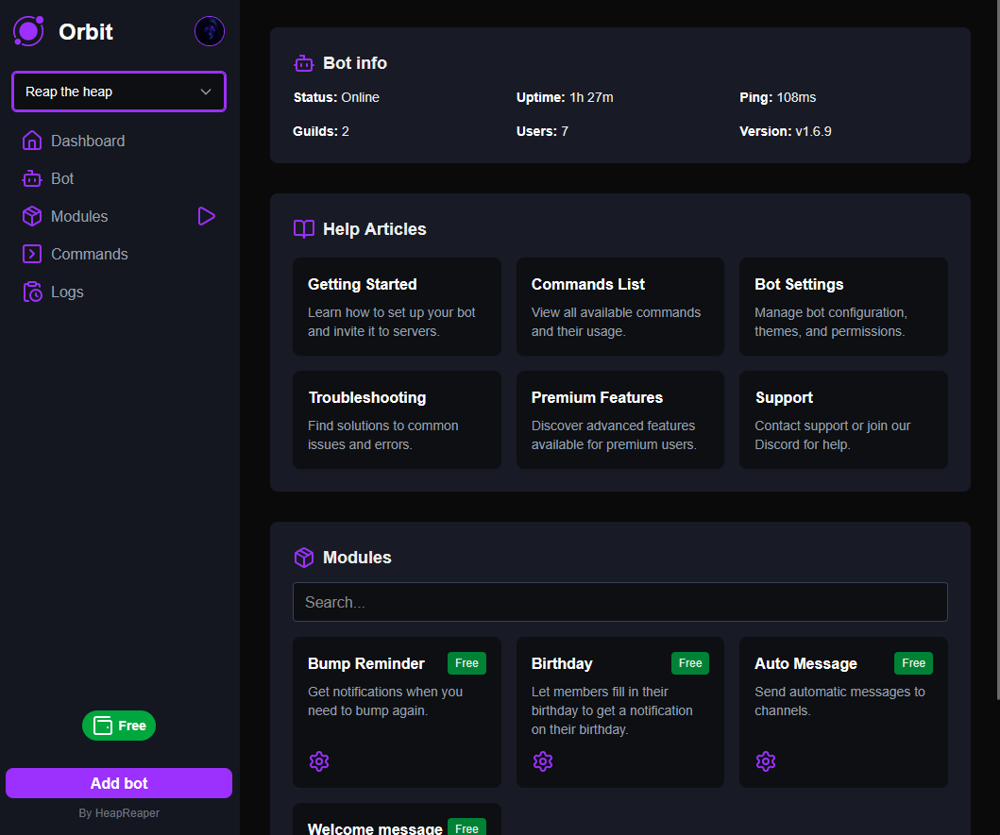
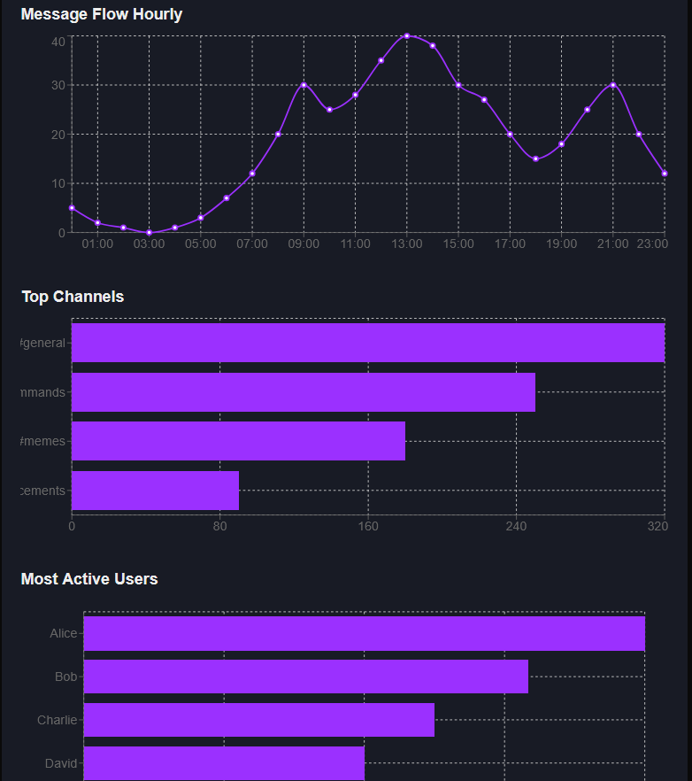
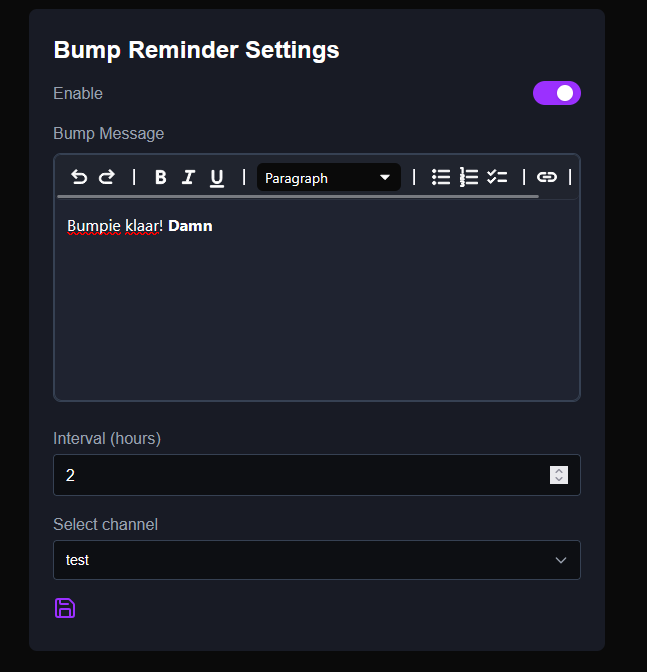
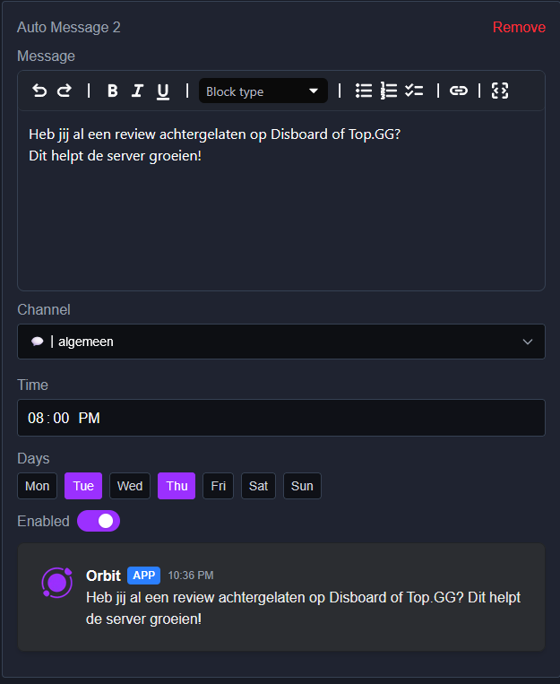
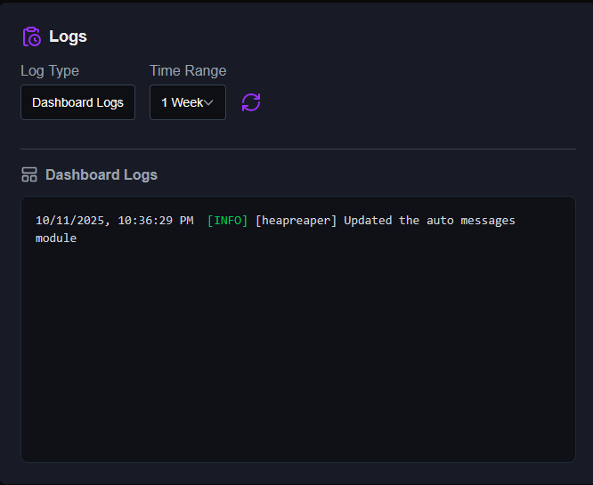

# Orbit

Take your Discord server to Orbit.
Enable, configure, and monitor features from the dashboard.  
With Features like tickets, birthdays, Logging and analytics, all in one bot.
---

## Features
- **Dashboard**: Nice view of the bot, help articles.
- **Discord bot**: Have one bot to handle everything.
---

## Tech Stack
- **Frontend/backend**: Next.js v15.5.4, React, TailwindCSS
- **Databases**: MariaDB with Prisma, Clickhouse, Redis (caching)
- **Authentication**: NextAuth.js (Discord OAuth)
- **State Management**: React Context API
- **Hosting**: Hetzner hosted Coolify
---

## Installation
This project is not intended for you to self host.

## Screenshots
**Dashboard**

**Analytics**

**Bump reminder**

**Auto messages**

**Logs**

