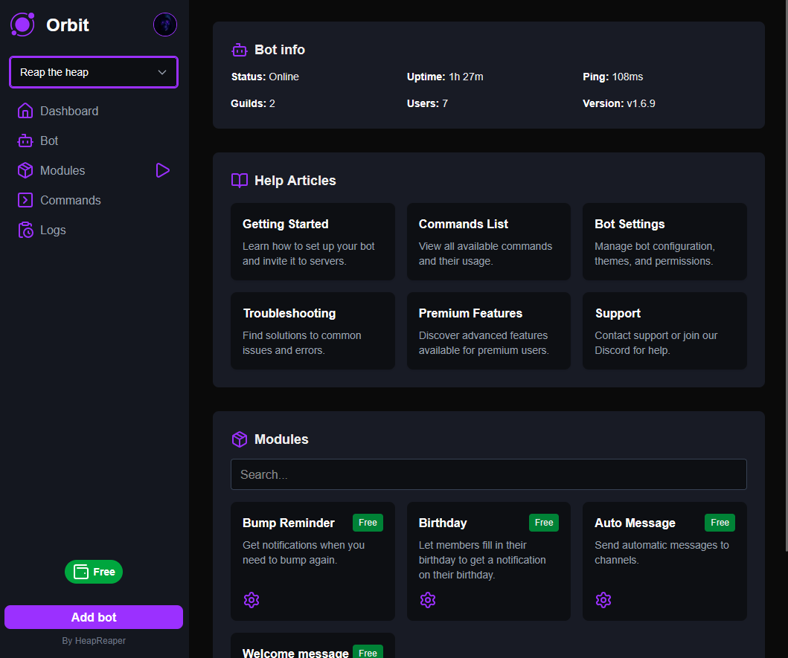
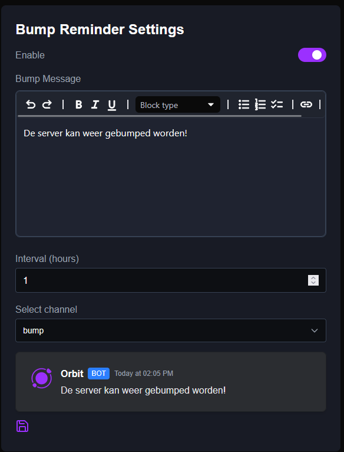
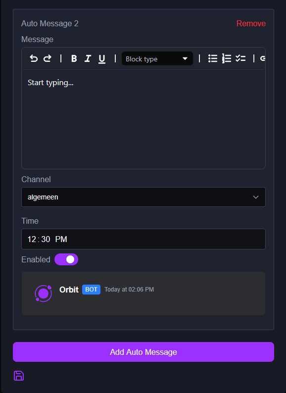

# Orbit

Orbit is a powerfull bot management tool for the Discord bot Lumix.
---

## Features
- **Dashboard**: Nice view of the bot, help articles.
- **Modules Management**: Manage modules and configure them.
- **Guild Selector**: Select different guilds where you're admin of.
---

## Tech Stack
- **Frontend/backend**: Next.js v15.5.4, React, TailwindCSS
- **Databases**: MariaDB with Prisma, Clickhouse, Redis (caching)
- **Authentication**: NextAuth.js (Discord OAuth)
- **State Management**: React Context API
- **Hosting**: Hetzner hosted Coolify
- **Icons**: Lucide React
- **Analytics**: Plausible Analytics

---

## Installation
This project is not intended for you to self host.

## Screenshots
**Dashboard**

**Bump reminder**

**Auto messsages**

